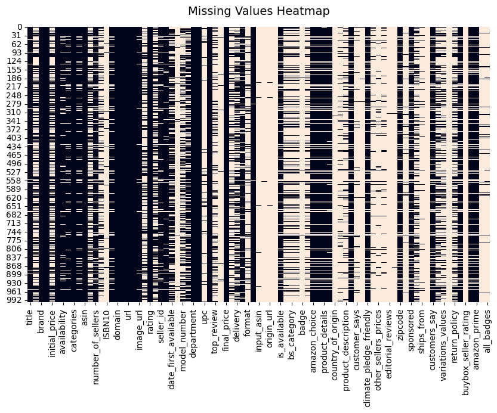
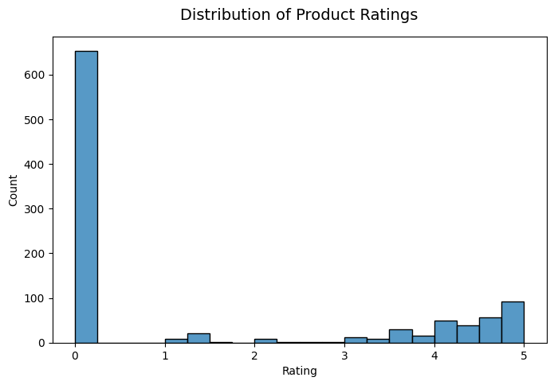
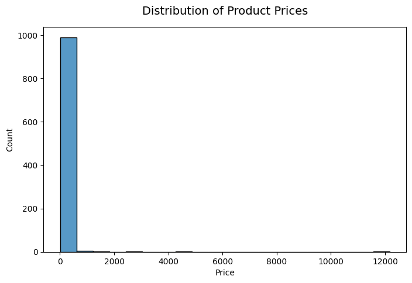
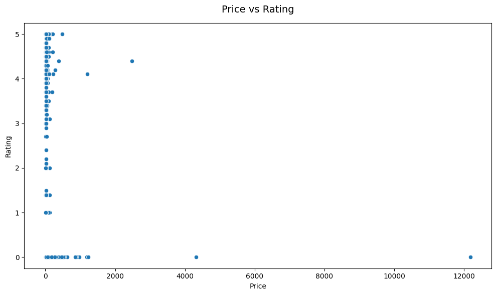
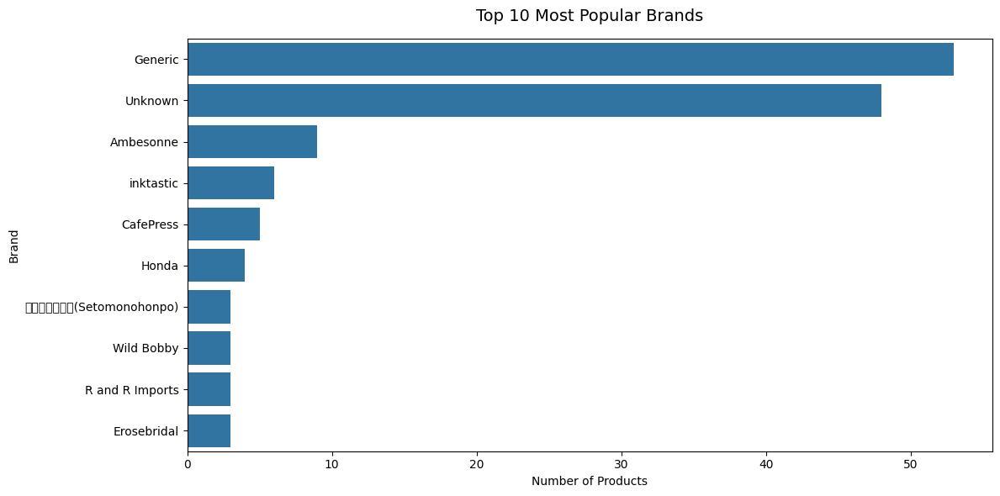
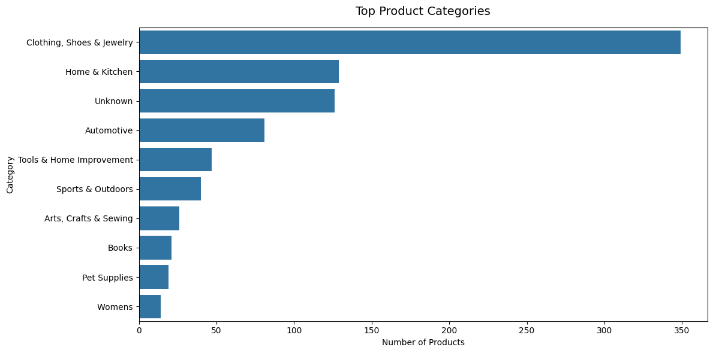
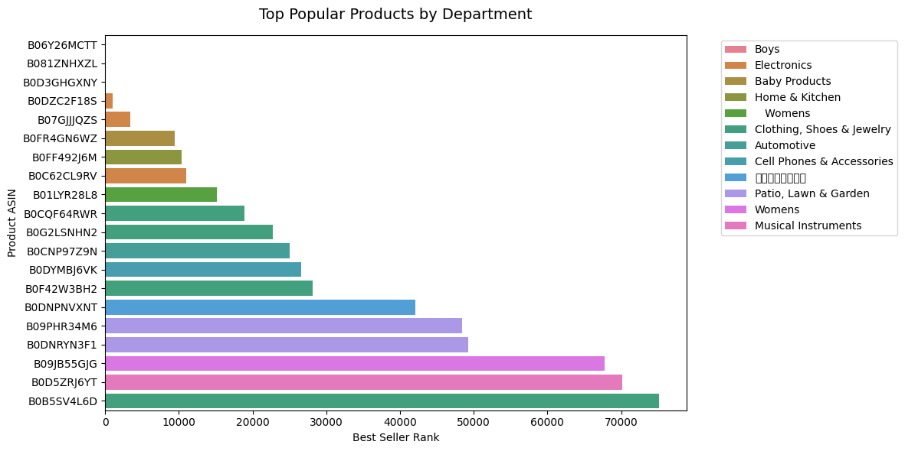

# E-Commerce Recommendation System

## Introduction

This project develops an e-commerce product recommendation system using Amazon product data.
(https://brightdata.com/cp/datasets/browse/gd_l7q7dkf244hwjntr0?id=hl_67a497d9&tab=sam)

The system combines multiple recommendation techniques to improve product discovery and provide personalized recommendations for different user scenarios.

### Recommendation Methods

* Popularity-Based Recommendation
* Content-Based Recommendation
* Collaborative Filtering
* Hybrid Recommendation System

---

## Application Demo

### Demo Video

[▶ Watch Application Demo](images/app_demo.mp4)

The project includes a Streamlit web application that allows users to search for products and receive recommendations interactively.

---

## EDA Visualization

### Missing Values Heatmap



### Rating Distribution



### Price Distribution



### Price vs Rating



### Top Brands



### Top Product Categories



### Popular Products by Department



---

## Techniques Used

* Data Cleaning
* Exploratory Data Analysis (EDA)
* TF-IDF Vectorization
* Cosine Similarity
* K-Nearest Neighbors (KNN)

---

## Model Evaluation

The recommendation models were evaluated using:

* Average Rating@K
* Precision@K
* RMSE
* MAE

### Evaluation Results

| Model                           | Metric            | Result |
| ------------------------------- | ----------------- | ------ |
| Popularity-Based Recommendation | Average Rating@10 | 5.00   |
| Content-Based Recommendation    | Precision@10      | 0.30   |
| Collaborative Filtering         | RMSE              | 2.1196 |
| Collaborative Filtering         | MAE               | 1.9116 |

---

## Technologies Used

* Python
* Pandas
* NumPy
* Scikit-learn
* Matplotlib
* Seaborn
* Streamlit
* Jupyter Notebook

---

## Project Structure

```bash
ecommerce-recommendation-system/

├── data/
│   └── amazon_products.csv
│
├── images/
│   ├── app_demo.mp4
│   ├── heatmap.png
│   ├── plot_popular_products_by_department.png
│   ├── plot_price_distribution.png
│   ├── plot_price_vs_rating.png
│   ├── plot_rating_distribution.png
│   ├── plot_top_brands.png
│   └── plot_top_departments.png
│
├── notebooks/
│   └── ecommerce_recommendation.ipynb
│
├── src/
│   ├── collaborative_model.py
│   ├── content_based_model.py
│   ├── eda.py
│   ├── feature_engineering.py
│   ├── hybrid_model.py
│   ├── popularity_model.py
│   └── preprocessing.py
│
├── .gitignore
├── app.py
├── main.py
├── README.md
└── requirements.txt
```

---

## Installation

### Clone Repository

```bash
git clone https://github.com/Thuquynh31/ecommerce-recommendation-system.git
```

### Install Dependencies

```bash
pip install -r requirements.txt
```

---

## Run the Project

### Run Streamlit Application

```bash
python -m streamlit run app.py
```

### Run Main Script

```bash
python main.py
```

---

## Future Improvements

* Use real user interaction data
* Improve recommendation accuracy
* Deploy the Streamlit application online
* Integrate image-based product recommendations

---

## Author

**Thu Quynh**
